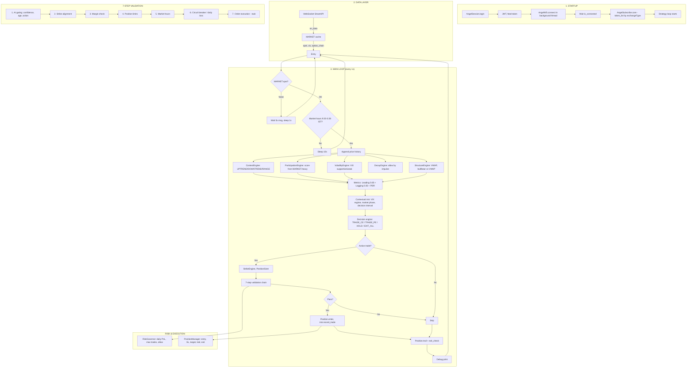

# Options Oracle – Architecture & Flow Diagram

## 1. Mermaid diagram (copy into Mermaid Live Editor or VS Code)



## 2. High-level flow (text)

```
[Angel Login] → [WebSocket connect - background thread] → [Subscribe tokens NSE]
       ↓
[Main loop]
   → Wait for MARKET.spot (Nifty 26000, VIX 26017)
   → Check market hours (9:20–15:28 IST)
   → Build price history
   → Context (UPTREND/DOWNTREND/RANGE)
   → Participation score
   → Volatility (VIX)
   → Decay allow
   → Structure (VWAP, bull/bear)
   → Combined Score (Leading×0.65 + Lagging×0.35 + PDR)
   → Decision: TRADE_CE / TRADE_PE / HOLD / EXIT_ALL
   → If trade: 7-step validation → Position.enter + RiskGovernor
   → Position trail + exit check
   → Debug print, sleep 1s, repeat
```

## 3. Component map

| Layer        | Module / Class           | Role |
|-------------|--------------------------|------|
| Data        | AngelSession             | Login, JWT, feed |
| Data        | AngelWS                  | WebSocket (background thread), on_data → MARKET |
| Data        | AngelSubscribe           | subscribe(token_list by exchangeType) |
| Data        | MARKET (MarketCache)     | spot, vix, heavy, option_chain, PDR/LMS history |
| Engines     | ContextEngine            | detect(prices) → UPTREND/DOWNTREND/RANGE |
| Engines     | ParticipationEngine      | score() from MARKET.heavy |
| Engines     | VolatilityEngine         | check(prev_vix) → SUPPORTIVE/WEAK |
| Engines     | DecayEngine              | allow(prices) by impulse |
| Engines     | StructureEngine          | vwap, bullish, bearish |
| Engines     | metrics                  | RSI, MA crossover, HV, leading/lagging, PDR, LMS, combined_score |
| Engines     | contextual_risk          | vix_regime, market_phase, decision_interval_seconds, is_market_hours |
| Engines     | decision_engine          | rule_based_decision → action, confidence, reasoning, strikeGuidance |
| Execution   | StrikeEngine             | select(spot, context, momentum) |
| Execution   | PositionSizer            | size(risk_pct, stop_distance, lot_size) |
| Execution   | validation_chain         | run_validation_chain (7 steps) |
| Execution   | PositionManager          | enter, trail, exit_check (SL/target) |
| Risk        | RiskGovernor             | allow, daily_pnl, circuit breaker, record_trade |
| Config      | config.settings          | INDEX, market hours, VIX regimes, LOT_SIZE, etc. |
```

## 4. Data flow (simplified)

```
Angel API → WebSocket ticks → MARKET (spot, vix, options)
    → prices[] in main
    → ContextEngine, ParticipationEngine, VolatilityEngine, DecayEngine, StructureEngine
    → metrics (leading, lagging, PDR) → combined_score
    → decision_engine (action, confidence, strikeGuidance)
    → validation_chain → PositionManager.enter / RiskGovernor
    → PositionManager.trail & exit_check
```
